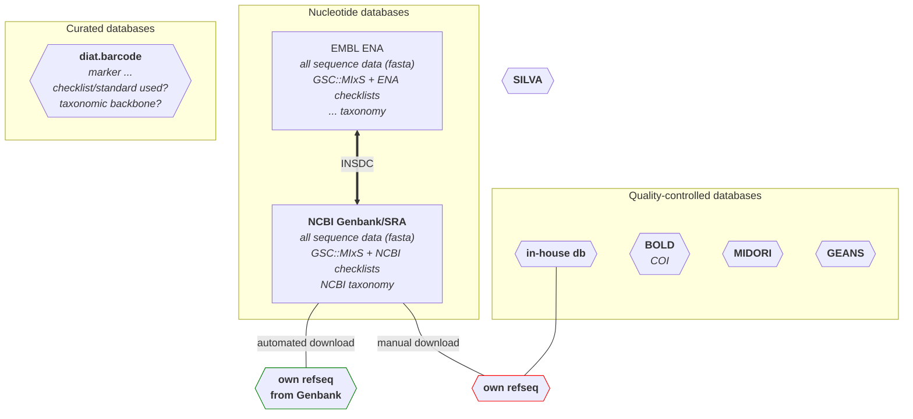

# T3.1 reference libraries

State of the reference library landscape as assessed in the WP4 use cases. I'm trying to cover the markers, standards used, taxonomic backbown, and data flows. 
For now this only maps the reference libraries reported in the WP4 use cases. Next, I will add those covered by WP2 D2.1.
I also included some of the WP4 recommendations (e.g. using automated pipelines).

