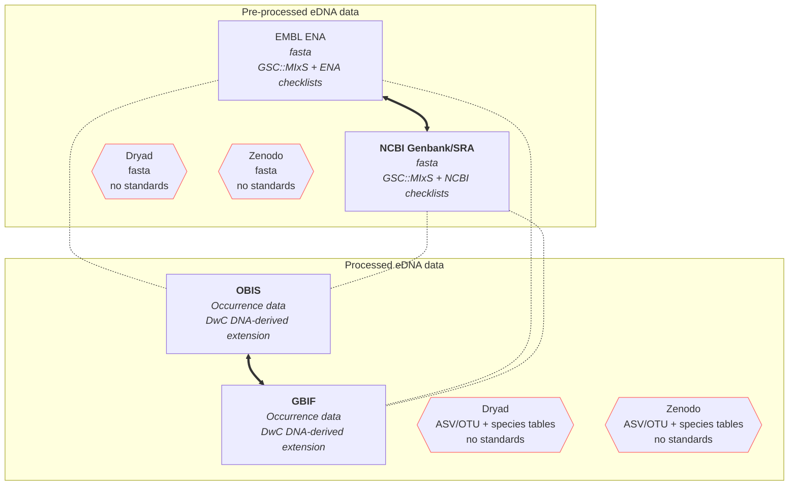

# T3.2 pre- and processed eDNA data repositories

Links and data flows between repositories and databases where pre-processed ("raw" reads) and processed (species- and ASV/OTU tables) eDNA data are published.

