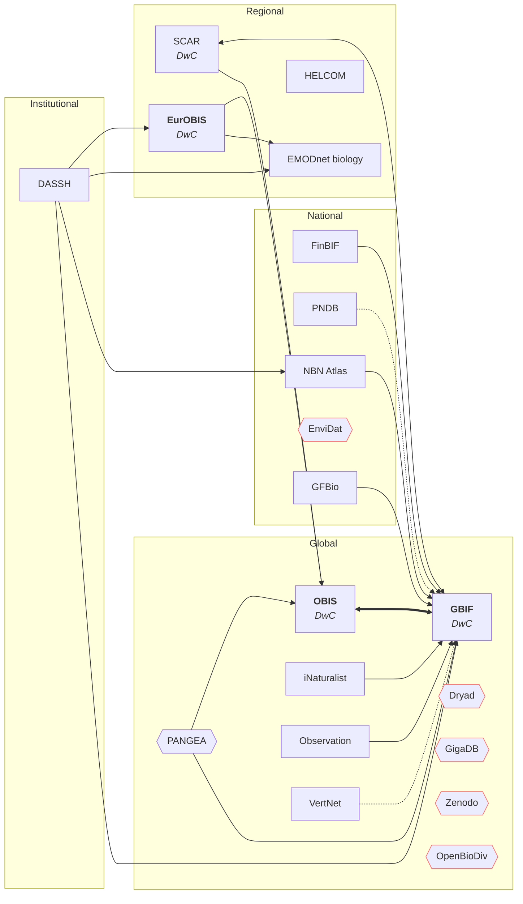

# T3.3.2 Biodiversity data publishers

Links and data flows between biodiversity data publishers investigated under T3.3 subtask T3.3.2

```mermaid
flowchart LR;
    subgraph Global;
        OBIS["`**OBIS**
            *DwC*`"]
        GBIF["`**GBIF**
            *DwC*`"]
        PANGEA{{PANGEA}}

        OBIS <==> GBIF
        PANGEA --> OBIS
        PANGEA --> GBIF
        iNaturalist --> GBIF
        Observation --> GBIF
        VertNet -.-> GBIF

        Dryad{{Dryad}}
        GigaDB{{GigaDB}}
        Zenodo{{Zenodo}}
        OpenBioDiv{{OpenBioDiv}}

        end
        subgraph Regional
        SCAR["`SCAR
            *DwC*`"]
        EurOBIS["`**EurOBIS**
            *DwC*`"] 
        EMODnet[EMODnet biology]
        SCAR <--> GBIF
        SCAR --> OBIS
        EurOBIS --> OBIS
        EurOBIS --> EMODnet
        HELCOM[HELCOM]
        end 

        subgraph National
        FinBIF --> GBIF
        PNDB -.-> GBIF
        NBN[NBN Atlas] --> GBIF
        EnviDat{{EnviDat}}
        GFBio --> GBIF
        end

        subgraph Institutional
        DASSH
        DASSH --> EurOBIS
        DASSH --> EMODnet
        DASSH --> NBN
        DASSH --> GBIF
        end

style Dryad stroke:#f66
style GigaDB stroke:#f66
style Zenodo stroke:#f66
style OpenBioDiv stroke:#f66
style EnviDat stroke:#f66
```

