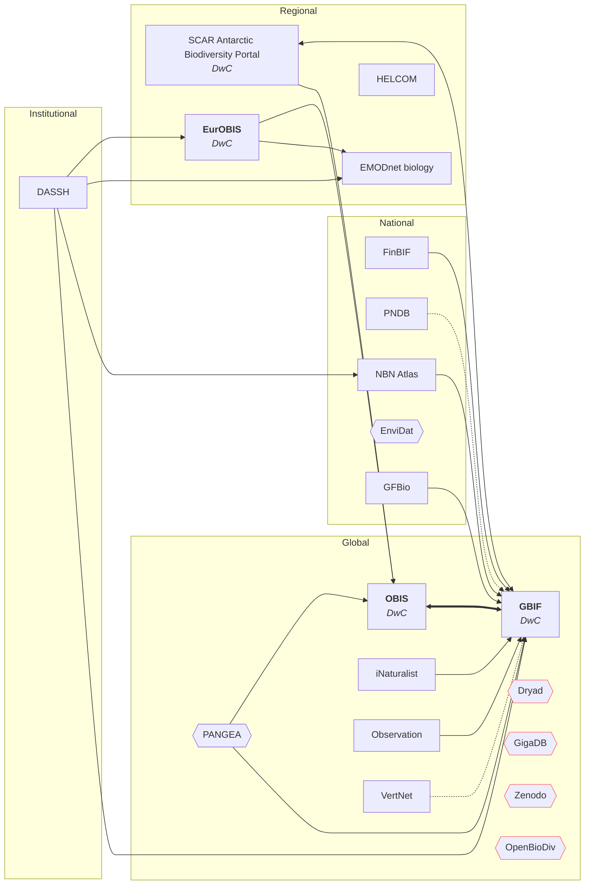

# T3.3.2 Biodiversity data publishers

Links and data flows between biodiversity data publishers under T3.3 subtask T3.3.2 investigated [here](https://docs.google.com/spreadsheets/d/19YDmwBHyQ-77WHH79rsKAJrEMVifIENL7HfiiGRdBQ8/edit?gid=0#gid=0)

